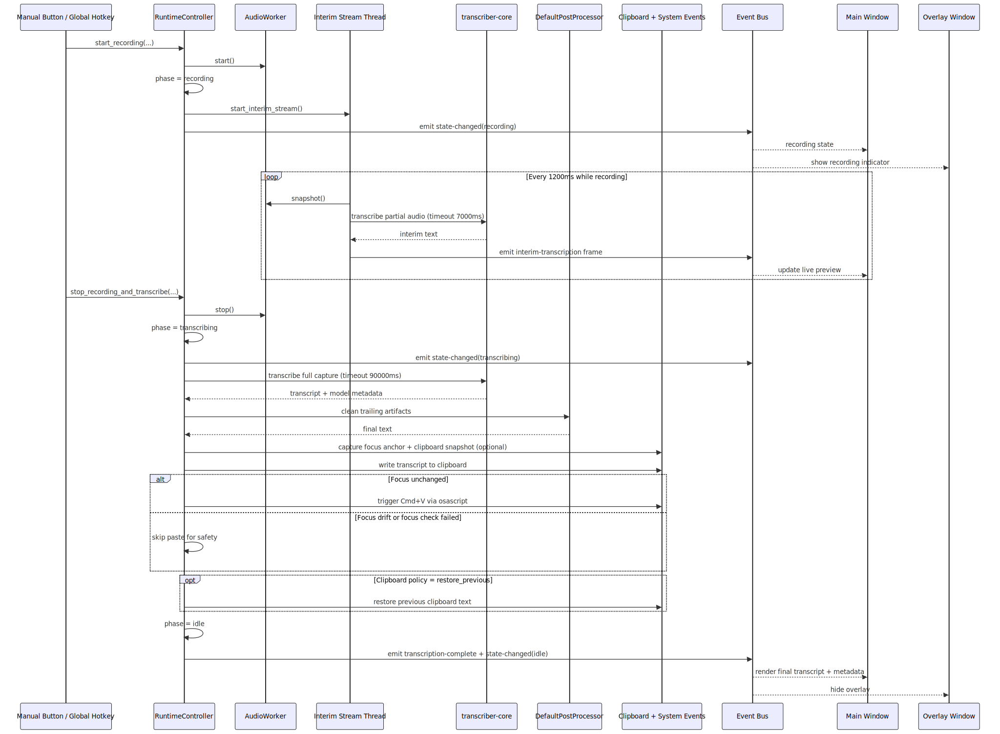
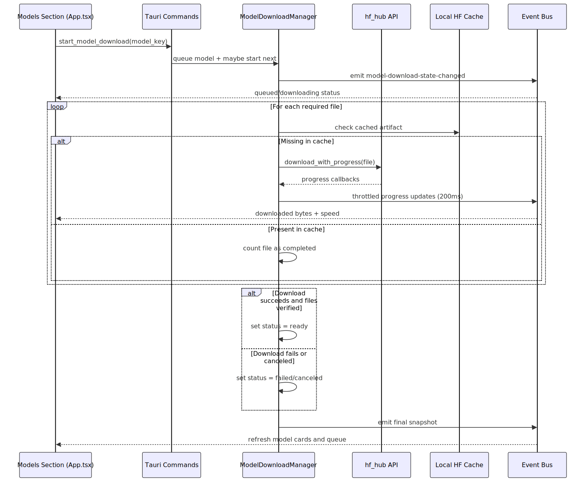
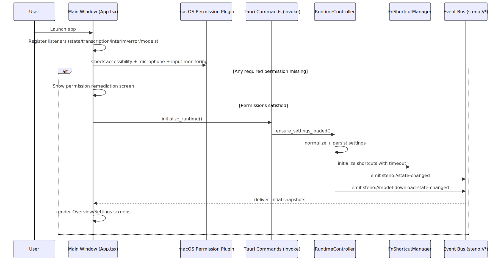

# Understanding This Codebase: Steno

This document is a deep technical walkthrough of the current Steno repository.
It explains architecture, runtime flow, file responsibilities, command/event contracts, and operational behavior.

## 1) What This Project Is

Steno is a **macOS-only local dictation desktop app** built with:
- React + TypeScript frontend (`src/`)
- Tauri v2 Rust backend (`src-tauri/`)
- Local transcription core (`transcriber-core` path dependency)

At runtime it captures microphone audio, transcribes locally (Whisper or Parakeet), then copies/pastes output into the currently focused application with safety checks.

## 2) Architecture At A Glance

Core architectural shape:
- Frontend windows (`main`, `overlay`) communicate through `invoke` commands and Tauri events.
- `RuntimeController` is the authoritative state machine for recording/transcribing/output.
- `ModelDownloadManager` is an independent subsystem for Whisper model artifact lifecycle.
- macOS integration is explicit (permissions, global hotkeys, clipboard, AppleScript paste, tray).

## 3) Runtime State Model

Authoritative phase enum (`runtime.rs`):
- `idle`
- `recording`
- `transcribing`
- `error`

Important behavior:
- Most failures are treated as **recoverable** and return to `idle`.
- Interim transcription runs only while `recording`.
- Overlay visibility is tied to phase transitions emitted by backend state.

## 4) Repository Layout (High-Signal Map)

### Root-level
- `README.md`: product overview and run/build instructions.
- `package.json`: frontend dependencies and npm scripts.
- `spec/`: HLD/LLD implementation records for major work items.

### Frontend (`src/`)
- `main.tsx`: entrypoint; routes by Tauri window label (`main` vs `overlay`).
- `App.tsx`: primary UI, startup orchestration, permissions UX, settings sections, runtime listeners.
- `OverlayApp.tsx`: recording overlay window behavior and lightweight phase indicator.
- `tauri.ts`: typed command/event bridge wrappers.
- `types.ts`: shared payload/type contracts matching backend serialization.
- `styles.css`: main and overlay styles.

### Backend (`src-tauri/src/`)
- `lib.rs`: Tauri app builder, tray/window lifecycle, command registration.
- `runtime.rs`: runtime state machine, audio/transcription/output flow, settings persistence.
- `audio_capture.rs`: CPAL input stream capture and WAV serialization.
- `shortcut.rs`: global hotkey registration and capture mode listener.
- `model_download.rs`: Whisper model catalog, queueing, download progress/state emission.
- `post_process.rs`: post-transcription text cleanup hook.
- `main.rs`: binary entrypoint calling `steno_lib::run()`.

### Backend config
- `src-tauri/tauri.conf.json`: app metadata, build config, `main` + `overlay` window definitions.
- `src-tauri/capabilities/default.json`: permissions/capability scope for windows.

## 5) Frontend Deep Dive

## 5.1 Entry Routing

`src/main.tsx` checks current window label:
- `main` -> render `<App />`
- `overlay` -> render `<OverlayApp />`

This keeps a single bundled frontend with label-based specialization.

## 5.2 Main App Responsibilities (`App.tsx`)

`App.tsx` is a composed “runtime console” with six sections:
- `overview`
- `input`
- `transcription`
- `models`
- `transcript`
- `diagnostics`

Startup logic includes:
- Platform detection (macOS gate)
- Listener registration with timeout guardrails
- Permission synchronization for Accessibility, Microphone, Input Monitoring
- Runtime initialization via `initialize_runtime`
- Watchdog timeout to fail fast on startup hangs

Runtime listeners consumed:
- `steno://state-changed`
- `steno://transcription-complete`
- `steno://interim-transcription`
- `steno://error`
- `steno://model-download-state-changed`

## 5.3 Overlay App Responsibilities (`OverlayApp.tsx`)

Overlay behavior:
- Subscribes to phase and interim events.
- Shows compact indicator when `recording` or `transcribing`.
- Briefly displays `done` state after transcription completion.
- Hides itself otherwise.

Overlay is presentation-only and does not mutate runtime state.

## 5.4 Frontend Command Surface (`tauri.ts`)

Commands exposed to frontend:
- `initializeRuntime`
- `setRecordMode`
- `setClipboardPolicy`
- `setHotkeyBindings`
- `captureHotkey`
- `setRuntimeSelection`
- `setModelProfile`
- `listModelDownloads`
- `startModelDownload`
- `cancelModelDownload`
- `getRecordMode`
- `startRecordingManual`
- `stopRecordingManual`
- `getRuntimeState`
- `setMicPermission`
- `setInputMonitoringPermission`

## 6) Backend Deep Dive

## 6.1 Tauri Shell (`lib.rs`)

`lib.rs` owns process-level concerns:
- Tauri plugins (logging, clipboard manager, macOS permissions).
- Managed singletons (`RuntimeController`, `ModelDownloadManager`, lifecycle state).
- Tray menu actions (`Show`, `Hide`, `Quit`).
- Close-request interception for `main` window (hide instead of quit).
- Command handler exports used by frontend invokes.

Notable lifecycle behavior:
- App keeps running in background when main window closes.
- Explicit quit is handled via tray menu and lifecycle flag.

## 6.2 Runtime Controller (`runtime.rs`)

`RuntimeController` wraps `RuntimeInner` inside `Arc<Mutex<...>>` and controls:
- Runtime phase + user settings.
- Active audio worker and hotkey manager.
- Interim transcription session metadata.
- Shortcut debounce and active-trigger tracking.

Major methods:
- `initialize`
- `set_mic_permission`
- `set_input_monitoring_permission`
- `set_mode`
- `set_hotkey_bindings`
- `set_runtime_selection`
- `set_model_profile`
- `set_clipboard_policy`
- `start_recording`
- `stop_recording_and_transcribe`
- `publish_error`

## 6.3 Audio Pipeline (`audio_capture.rs` + `runtime.rs`)

Capture implementation:
- `AudioCapture` opens default input device via CPAL.
- Supports source sample formats `f32`, `i16`, `u16`.
- Multichannel input is downmixed to mono by averaging frames.
- Samples are buffered in-memory while recording.
- Stopping capture returns `CapturedAudio` and writes WAV on transcription step.

Worker isolation:
- Runtime talks to audio capture through channel-based `AudioWorker` commands.
- Start/stop/snapshot all have explicit timeout paths.

## 6.4 Global Shortcut Pipeline (`shortcut.rs` + `runtime.rs`)

- `FnShortcutManager` registers push-to-talk and toggle bindings.
- A dedicated polling thread reads hotkey events and calls runtime handler.
- Toggle mode has debounce (`TOGGLE_DEBOUNCE_MS`) to avoid repeat churn.
- Hotkeys are temporarily suspended while capturing new shortcut values.

Validation rules on shortcuts:
- Must parse as `handy_keys::Hotkey`.
- Must include modifier key.
- Push and toggle cannot be equal.
- Reserved macOS combos are rejected.

## 6.5 Transcription + Output Pipeline

Flow summary:
1. Start capture -> phase `recording`.
2. Interim loop periodically snapshots audio and emits interim transcript frames.
3. Stop capture -> phase `transcribing`.
4. Full transcription runs with timeout.
5. Post-process text cleanup executes.
6. Output actions run (clipboard write, optional paste, optional clipboard restore).
7. Emit final result event and return to `idle`.

Safety and reliability mechanisms:
- Timeouts for recording start/stop, transcription, clipboard operations.
- Retry wrappers for clipboard write and paste operations.
- Focus-anchor safety check before auto-paste to avoid wrong-app writes.
- Reliability warning event when latency target is missed.

## 6.6 Interim Transcription Strategy

Interim behavior is designed to remain non-destructive:
- Emits UI preview only.
- Never writes interim content to external apps.
- Auto-disables interim mode after repeated timeout budget breaches.
- Tracks counters for emits/drops/timeouts/auto-disables.

## 6.7 Post-processing Hook (`post_process.rs`)

Current default post-processing is intentionally small:
- Trims trailing whitespace.
- Removes a specific trailing artifact phrase (`you you typed`) when present at tail.

This is isolated behind a `PostProcessor` trait for future expansion.

## 7) Model Download Subsystem

`ModelDownloadManager` responsibilities:
- Maintains fixed Whisper catalog (`fast`, `balanced`, `accurate`).
- Determines readiness based on cache artifact presence.
- Queues downloads and runs one active job at a time.
- Emits progress snapshots over event bus.
- Supports cancellation for queued/active jobs.

Download details:
- Uses `hf_hub` API and cache.
- Required files per model: `config.json`, `tokenizer.json`, `model.safetensors`.
- Progress emissions throttled (`PROGRESS_EMIT_THROTTLE_MS = 200`).

## 8) Data Contracts

Cross-layer contracts are mirrored in:
- Rust structs/enums in `runtime.rs` and `model_download.rs`
- TypeScript types in `src/types.ts`

Primary payloads:
- `RuntimeState`
- `RuntimeInitResult`
- `RuntimeError`
- `TranscriptionResult`
- `InterimTranscriptionFrame`
- `ModelDownloadsSnapshot`

## 9) Command/Event Contract Table

### Commands (`invoke`)
- Initialization: `initialize_runtime`, `get_runtime_state`
- Permissions: `set_mic_permission`, `set_input_monitoring_permission`
- Capture control: `start_recording_manual`, `stop_recording_manual`
- Configuration: `set_record_mode`, `set_clipboard_policy`, `set_hotkey_bindings`, `set_runtime_selection`, `set_model_profile`
- Hotkey UX: `capture_hotkey`
- Model downloads: `list_model_downloads`, `start_model_download`, `cancel_model_download`

### Events (`listen`)
- `steno://state-changed`
- `steno://transcription-complete`
- `steno://interim-transcription`
- `steno://error`
- `steno://model-download-state-changed`

## 10) Persistence, Paths, and Artifacts

Runtime writes/reads:
- Settings: `settings.json` under `app.path().app_config_dir()`.
- Temp artifacts: WAV and transcript files under `${temp_dir}/steno`.
- Model artifacts: Hugging Face local cache location used by `hf_hub`.

Persisted fields include:
- Mode
- Clipboard policy
- Push/toggle shortcuts
- Runtime selection
- Model profile

## 11) macOS Integrations and Permissions

Permissions used:
- Microphone: audio capture capability
- Accessibility/Input Monitoring: global shortcut and automation behavior

OS-level integrations:
- Global hotkeys via `handy-keys`
- Auto-paste via AppleScript (`System Events` Cmd+V)
- Focus check via AppleScript (frontmost process name)
- Clipboard via Tauri clipboard plugin
- Tray/menubar surface for background operation

## 12) Startup Sequence

Startup guardrails:
- Listener registration timeout.
- Runtime init timeout.
- Global startup watchdog timeout.
- Permission re-check on window focus when access is missing.

## 13) File-by-File Responsibility Matrix

| File | Responsibility |
|---|---|
| `src/main.tsx` | Window-label route into main vs overlay React tree |
| `src/App.tsx` | Primary UI, startup lifecycle, permissions, sectioned settings UX |
| `src/OverlayApp.tsx` | Overlay indicator behavior + phase/reactive rendering |
| `src/tauri.ts` | Strongly typed command and event adapters |
| `src/types.ts` | Shared serialized payload contracts |
| `src/styles.css` | Main + overlay visual layer |
| `src-tauri/src/lib.rs` | App shell, tray, window lifecycle, command exports |
| `src-tauri/src/runtime.rs` | Runtime state machine, audio lifecycle, transcription, output actions |
| `src-tauri/src/audio_capture.rs` | CPAL stream capture + WAV writer |
| `src-tauri/src/shortcut.rs` | Hotkey registration thread + capture utility |
| `src-tauri/src/model_download.rs` | Model catalog, queue, download progress, cache readiness checks |
| `src-tauri/src/post_process.rs` | Post-transcript cleanup hook |
| `src-tauri/tauri.conf.json` | Window definitions, build wiring, bundle metadata |
| `src-tauri/capabilities/default.json` | Window capability permissions |

## 14) Existing Design Docs In `spec/`

The repository already includes HLD/LLD artifacts that align with current implementation areas:
- Always-on background runtime and tray behavior.
- Recording overlay indicator.
- Auto-paste and clipboard policy.
- Realtime dictation feasibility and phased safety model.

Those docs explain intent and rollout history; this document maps what is currently implemented in code.

## 15) Operational Commands

Run/build/test from project root:
- `npm install`
- `npm run tauri dev`
- `npm run build`
- `cargo check --manifest-path src-tauri/Cargo.toml`
- `cargo test --manifest-path src-tauri/Cargo.toml`

## 16) Known Constraints and Boundaries

Current boundaries (by design):
- macOS only.
- No persistent transcript history.
- No active-app incremental live insertion of interim text.
- No cross-platform permission model abstraction.

